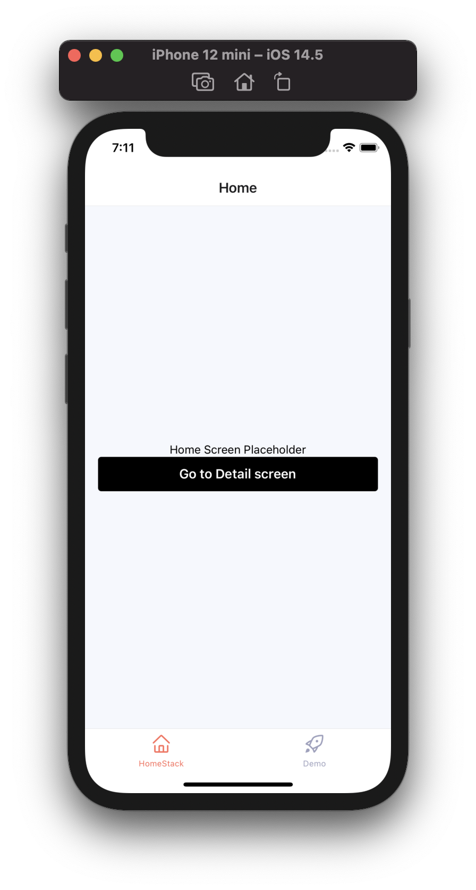
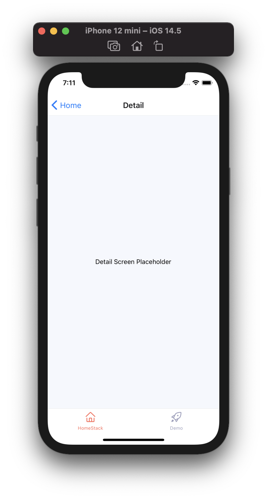
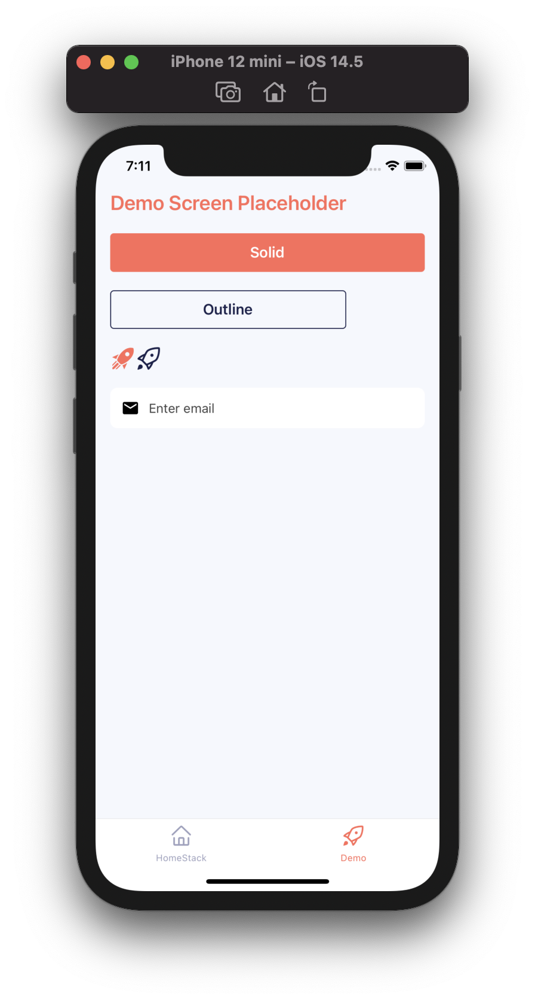
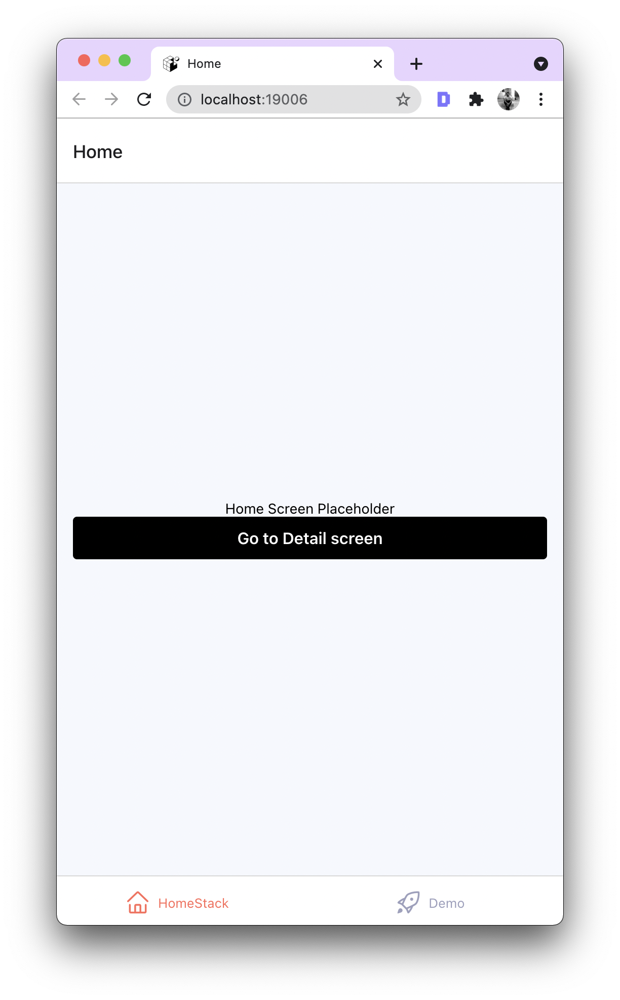
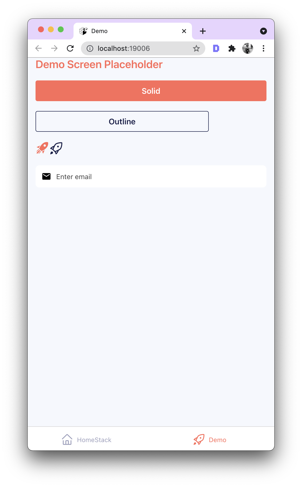

# Expo Template

Bare minimum Expo template to kickstart a React Native app with following features:

- Expo SDK `41.x.x`
- React Navigation v6
  - ⚠️ React Navigation v6 library is an upcoming version.
  - Based on Stack and Tab navigators
- Reusable components to get started with:
  - Button
  - IconButton
  - Input
- ESlint and Prettier configured

## Usage

> Be sure to have the [Expo CLI](https://docs.expo.io/workflow/expo-cli/) installed.

<!-- fix -->

```sh
expo init --template expo-template
```

Commands to trigger an instance of the app in local development mode:

- Run on iOS: `yarn ios` or `npm run ios` or `expo start` > Press `i`
- Run on Android: `yarn android` or `npm run android` or `expo start` > Press `a`
- Run on Web: `yarn web` or `npm run web` or `expo web` > Press `w`
- Lint Code: `yarn lint` or `npm run lint`

## Screens

- One mobile simulator:

 



- On web:

 



## File Structure

```sh
Expo Template
├── assets ➡️ All static assets
├── components ➡️ All re-suable UI components for screens│
│   └── Button.js ➡️ Button component
│   └── Input.js ➡️ TextInput component
│   └── IconButton.js ➡️ Button with icon only component, support different variants from @expo/vector-icons
├── navigation
│   └── HomeStack.js ➡️ Routes such as Home & Detail screen
│   └── MainTabs.js ➡️ Routes such as HomeStack & Demo screen
│   └── RootNavigator.js ➡️ Routes wrapped by NavigationContainer
├── screens
│   └── DemoScreen.js ➡️ Screen that hows a little demo of reusable components
│   └── HomeScreen.js ➡️ Home screen
│   └── DetailScreen.js ➡️ Detail screen
├── App.js ➡️ Entry Point for Mobile apps
├── app.json ➡️ Expo config file
└── babel.config.js ➡️ Babel config (should be using `babel-preset-expo`)
```

## Authors

- [@amanhimself](https://www.twitter.com/amanhimself)
